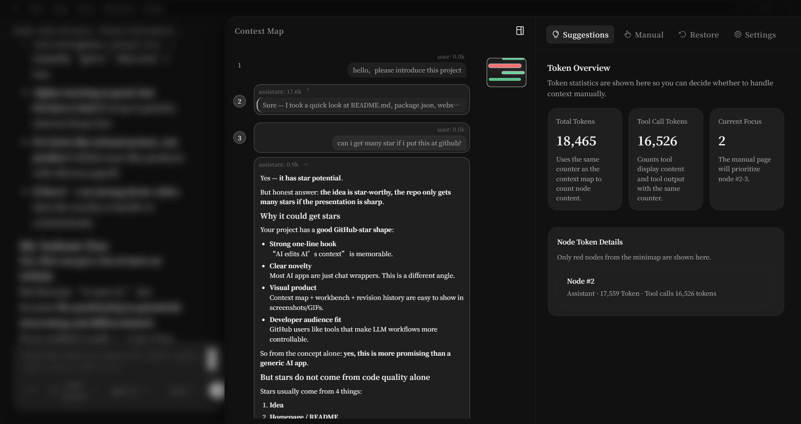
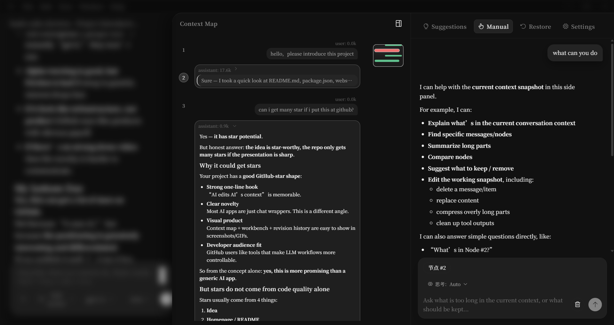
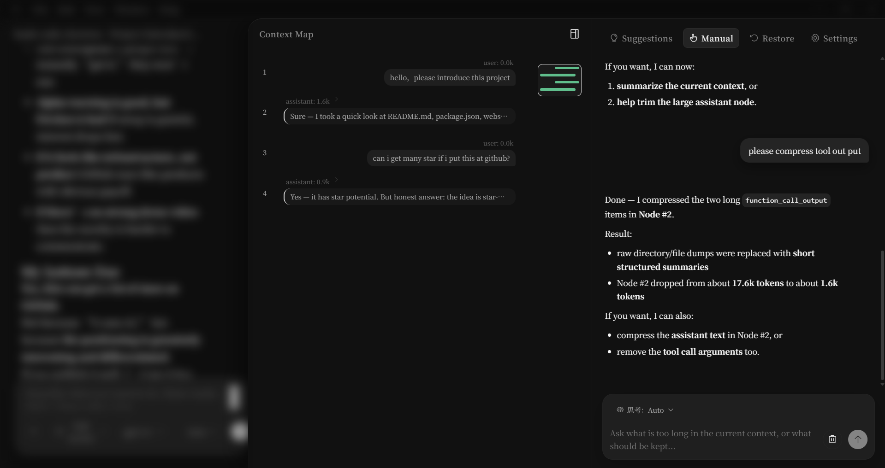

<p align="center">
  
</p>

<h1 align="center">hashcode</h1>

<p align="center">
  <strong>Cursor uses AI to edit code — we use AI to edit AI's context. 🪆</strong>
</p>

<p align="center">
  <a href="#-core-features">Features</a> •
  <a href="#-architecture">Architecture</a> •
  <a href="#-installation">Install</a> •
  <a href="#-roadmap">Roadmap</a> •
  <a href="#join-us">Join us</a> •
  <a href="#-faq">FAQ</a>
</p>

<p align="center">
  <strong>English</strong> | <a href="README.zh-CN.md">中文</a>
</p>

<p align="center">
  
  
  
  
  
  
</p>

> [!WARNING]
> **Alpha Status**: hashcode is in early development. There are incomplete features and known bugs. We're sharing this project because we believe the direction is worth exploring, not because it's finished. Testing, feedback, and contributions are very welcome.

<h2 id="join-us">Join us</h2>

If you want to test hashcode, contribute ideas, report bugs, or build this direction together, email us at <a href="mailto:3455744878@qq.com">3455744878@qq.com</a>.

### Codex Version

The Codex version is now available. If you use Codex and want the same context editing workflow, check out [codex-context-editor-proxy](https://github.com/HaShiShark/codex-context-editor-proxy).

---

## 🤔 The Problem

Every AI chat app lets you **send** messages. None of them lets you **see what the model actually sees**.

Your context window is a black box. You can't see it. You can't edit it. You can't roll it back. When your conversation gets long, the AI silently degrades — and you have zero control over why. Even tools that offer `/compact` are too blunt and aggressive.

> **What if your LLM's context window was treated like source code — visible, editable, and version-controlled?**

That's what this project does.

## 💡 The Idea

If Cursor can use AI to edit your **code**, why can't we use AI to edit AI's **context**?

```
Cursor:    AI  →  edits  →  Code
                                         
Us:        AI  →  edits  →  AI's Context  🪆
```

**hashcode** is the first desktop client that:

1. **Visualizes** the entire context your main model actually consumes — as a structured **Context Map**, not a chat log.
2. **Deploys a second AI model** that can inspect, compress, rewrite, and delete items inside the context — just like a code editor's AI assistant.
3. **Version-controls** every edit, so you can roll back to any previous context state.

One AI doing the thinking. Another AI grooming what the first one sees. 🪆

---

## 🌟 Core Features

### 📍 Context Map — See Everything Your Model Sees




The right sidebar turns the raw transcript into a structured, scrollable map:

- **Numbered nodes** — `#1 #2 #3 ...` — each user/assistant turn is one node
- **Token weight colors** — 🟢 normal / 🟡 heavy / 🔴 very heavy — instantly spot bloat
- **Minimap** — bird's-eye overview with a draggable viewport rectangle, like VS Code's minimap
- **Expand on click** — collapsed by default, expand any node to see full markdown or tool call details
- **Multi-select** — `Ctrl+Click` or drag the gutter to select nodes for the AI editor

### 🪆 Context Workbench — AI Editing AI's Context





The right panel is the command center for the second AI model, with four tabs:

| Tab | What It Does |
|-----|-------------|
| **💡 Suggest** | Auto-analyzes your context: which nodes are bloated, which tool outputs are redundant |
| **✏️ Manual** | Chat with the context model — "compress nodes #4-7" or "delete the weather tool output" |
| **⏪ Restore** | Browse every context revision, click to restore any previous version |
| **⚙️ Settings** | Configure the context model independently (different model, different provider) |

### 🔧 Precision Editing Tools

The context model has surgical tools to modify individual items inside the context:

| Tool | What It Does | Example |
|------|-------------|---------|
| `get_node_details` | Inspect a node's full protocol-layer items | "Show me what's inside node #4" |
| `delete_item` | Remove a specific item from a node | "Delete the shell output from node #6" |
| `replace_item` | Rewrite an item with new content | "Replace the verbose tool output with a summary" |
| `compress_item` | AI-compress an item, preserving its type | "Compress the function_call_output in node #3" |
| `compress_nodes` | Merge multiple nodes into one summary node | "Summarize nodes #2-5 into a single node" |
| `delete_nodes` | Remove entire nodes from context | "Drop nodes #1-3, they're no longer relevant" |

### ⏪ Version Control for Context

Every edit round creates a **revision** — a full snapshot of your context state:

```
Revision #1  ← "Compressed weather tool outputs"        [Restore]
Revision #2  ← "Deleted redundant shell commands"       [Restore] ← Active
Revision #3  ← "Merged nodes #2-5 into summary"         [Restore]
```

- **Linear rollback** — click any revision to restore
- **Undo restore** — changed your mind? One-click undo (until your next action)
- **Full snapshots** — no patches, no merge conflicts. Every revision is a complete copy

### 🔌 Multi-Provider Support

Connect to any LLM provider — for both your main model and your context editor model:

| Provider | Protocol | Status |
|----------|----------|--------|
| **OpenAI** | Responses API | ✅ Built-in |
| **Claude** | Messages API | ✅ Built-in |
| **Gemini** | GenerateContent API | ✅ Built-in |
| **Custom** | Chat Completions | ✅ Any OpenAI-compatible endpoint |

Mix and match: use GPT for chatting, Claude for context editing. Each provider has independent API key and base URL configuration.

### 🎨 Desktop Client

- **Native window**: Electron desktop app, Windows supported (macOS / Linux planned)
- **Three-panel layout**: sidebar → chat → context map + workbench
- **Dark theme**: deep blacks, no eye strain, designed for long sessions
- **Streaming responses**: both main chat and context model stream in real-time
- **File attachments**: drag & drop images and files into the chat
- **Markdown rendering**: full GFM, syntax highlighting, Mermaid diagrams
- **Project workspaces**: organize conversations by project, with file tree browsing

---

## 🏗️ Architecture

### The "Two-Model" Architecture

1. **Main Model** — the AI you chat with. It reads/writes files, runs commands, answers questions.
2. **Context Model** — a separate AI that only sees the main model's context. It can analyze, compress, and restructure it.

They never run in parallel on the same session. When the context model is editing, the main chat is paused (and vice versa). This prevents conflicting writes.

### Tech Stack

| Layer | Technology | Why |
|-------|-----------|-----|
| **Desktop Shell** | Electron 37 | Cross-platform native window, Python backend auto-managed |
| **Frontend** | React 19 + TypeScript + Vite | Fast dev, type safety, modern DX |
| **Backend** | Python (child process) | Zero-framework, minimal deps, lifecycle managed by Electron |
| **LLM Runtime** | Custom `agent_runtime` | Provider-agnostic adapter layer (OpenAI / Claude / Gemini) |
| **Storage** | Local JSON (user data dir) | No database needed, data stays local |
| **Streaming** | Server-Sent Events (SSE) | Real-time token streaming |

### How It Runs

```
┌──────────────────────────────────────────────────────┐
│                  Electron Main Process                │
│                                                      │
│   app.whenReady()                                    │
│     ├── 1. Find an available port                    │
│     ├── 2. Spawn Python child process (web_server)   │
│     ├── 3. Wait for backend /api/init to be ready    │
│     └── 4. Create BrowserWindow → load frontend      │
│                                                      │
│   app.on('before-quit')                              │
│     └── Kill Python child process                    │
└──────────┬───────────────────────────────────────────┘
           │
    ┌──────▼──────┐     HTTP + SSE     ┌──────────────┐
    │  Renderer   │ ◄────────────────► │ Python       │
    │  React App  │                    │ Backend      │
    │             │                    │              │
    │ · Chat      │                    │ · Main Agent │
    │ · Ctx Map   │                    │ · Ctx Agent  │
    │ · Workbench │                    │ · State Mgr  │
    │ · Settings  │                    │ · Local JSON │
    └─────────────┘                    └──────────────┘
```

---

## 📦 Installation

### Option 1: Run from Source (Developers)

#### Prerequisites

- Python 3.10+
- Node.js 18+
- At least one LLM API key (OpenAI / Anthropic / Google)

```bash
git clone https://github.com/YOUR_USERNAME/context-editor-agent.git
cd context-editor-agent

# Python environment
python -m venv .venv
# Windows:
.venv\Scripts\Activate.ps1
# macOS / Linux:
source .venv/bin/activate
pip install -r requirements.txt

# Frontend dependencies
npm install

# Launch the Electron desktop client
npm run dev:electron
```

Configure your API key in the Settings page after launching.

### Option 2: Build Installer

```bash
# Build Windows .exe installer
npm run dist:win
```

The installer is generated in the `release/` directory. Double-click to install, ready to use.

---

## 🗺️ Roadmap

### ✅ Done (v0.1 — Current)

- [x] Main chat with streaming responses
- [x] Context Map with minimap and node selection
- [x] Context Workbench (Suggest / Manual / Restore / Settings)
- [x] Working snapshot + atomic commit lifecycle
- [x] Revision history with linear rollback & undo-restore
- [x] Multi-provider support (OpenAI, Claude, Gemini, Custom)
- [x] Context model tools: inspect, delete, replace, compress, summarize
- [x] File attachments in chat
- [x] Project workspace with file tree
- [x] Full markdown rendering with syntax highlighting
- [x] Electron desktop client + Windows installer

### 🔜 Next

- [ ] Context monitor model that auto-evaluates importance and maintains context
- [ ] Expand capabilities with more mainstream agent features

---

## ❓ FAQ

<details>
<summary><strong>How is this different from Claude Code and Codex?</strong></summary>

Claude Code and Codex both have context compression capabilities, but users have no way of knowing how the compression works, what was compressed, what the context actually contains after compression, or whether the model still remembers a previous issue.

Real-world examples:
1. During task execution, you want to ask a simple question but are afraid of polluting the main context
2. Occasionally, large amounts of useless error logs end up in the context with no way to selectively remove them

hashcode treats the context window as an **editable document**. You can see every token the model will consume, remove bloated tool outputs, compress old turns, or roll back to earlier states — all without losing your conversation.

</details>

<details>
<summary><strong>Does the context model actually modify what the main model sees?</strong></summary>

Yes. When the context model compresses or deletes items, those changes are committed to the canonical transcript. The next time the main model responds, it sees the edited version. This is not a UI trick — it's actual context engineering.

</details>

<details>
<summary><strong>Does this reduce cache hit rates?</strong></summary>

Theoretically yes, but when an agent is making frequent API calls, each context operation recalculates the cache at most once. This is far cheaper than carrying around useless context indefinitely.

</details>

---

## 🤝 Contributing

This project is in early alpha. Contributions, ideas, and bug reports are very welcome!

1. Fork the repo
2. Create a feature branch (`git checkout -b feature/amazing-thing`)
3. Commit your changes
4. Push and open a Pull Request

---

## 📄 License

MIT — do whatever you want with it.

---

<p align="center">
  <strong>🪆 AI editing AI — it's turtles all the way down.</strong>
</p>

<p align="center">
  <sub>If you find this project interesting, consider giving it a ⭐ — it helps others discover it.</sub>
</p>
